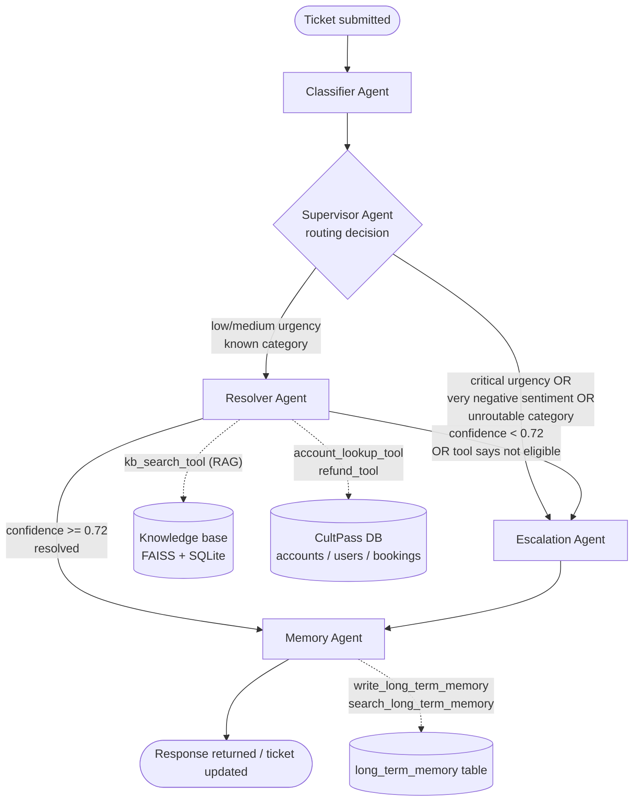

# UDA-Hub — Multi-Agent Architecture

## 1. Overview

UDA-Hub (**U**niversal **D**ecision **A**gent Hub) is the operational brain behind
CultPass's support desk. It ingests a support ticket (free text + metadata such as
platform, urgency, timestamps), decides which specialized agent should own it,
retrieves knowledge or invokes tools when needed, resolves the ticket or escalates
it to a human, and writes what it learned back to memory so future tickets from the
same customer are handled with context.

The system is built with **LangGraph**, using the **Supervisor pattern**: a router
node inspects a shared, typed state object and decides which specialist node runs
next. There is no prebuilt `create_react_agent` / `create_supervisor` helper in use
— every node and edge in `agentic/workflow.py` is hand-built with `StateGraph` so
the routing logic is fully explicit and testable.

## 2. Two datastores, two owners

| Database | File | Owned by | Notebook | Tables |
|---|---|---|---|---|
| External DB | `data/external/cultpass.db` | CultPass (UDA-Hub's customer) | `01_external_db_setup.ipynb` | `accounts`, `users`, `bookings` |
| Core DB | `data/core/udahub.db` | UDA-Hub itself | `02_core_db_setup.ipynb` | `tickets`, `ticket_metadata`, `ticket_messages`, `knowledge`, `long_term_memory`, `agent_run_log` |

This mirrors reality: UDA-Hub is a third-party product plugged into CultPass's
systems. It can *read* CultPass's account/subscription/booking data through tools,
but the ticket, knowledge-base and memory data are entirely UDA-Hub's own. Keeping
them in separate SQLite files makes the boundary explicit and is what the two
"external" vs "core" setup notebooks build.

## 3. Agent roster



| Agent | File | Responsibility |
|---|---|---|
| **Classifier** | `agentic/agents/classifier_agent.py` | Reads the raw ticket text + metadata and produces a structured `Classification` (category, urgency, sentiment, one-line summary) via an LLM structured-output call. This is the only agent that talks to the *raw* customer text. |
| **Supervisor** | `agentic/agents/supervisor_agent.py` | Pure routing logic (rule-based, not an LLM call) over the classifier's output plus any long-term memory context. Decides `resolver` vs `escalation`. Documented as a conditional edge, not a node with side effects. |
| **Resolver** | `agentic/agents/resolver_agent.py` | The "do the work" agent. Calls `kb_search_tool` to retrieve candidate knowledge articles (RAG), and — when the category needs an account action — calls `account_lookup_tool` / `refund_tool`. Computes a confidence score from retrieval similarity and tool outcomes. If confident, drafts the resolution message; if not, sets `needs_escalation=True`. |
| **Escalation** | `agentic/agents/escalation_agent.py` | Builds a structured hand-off summary (ticket, classification, what the resolver already tried, and why it couldn't finish) for a human agent, and sets ticket status to `escalated`. |
| **Memory** | `agentic/agents/memory_agent.py` | Terminal node. Persists the outcome to `ticket_messages`/`tickets` (core DB), writes a resolution summary and any customer preference it noticed to `long_term_memory`, and appends a structured line to `agent_run_log`. |

That's 5 specialized agents (≥ 4 required), each single-responsibility.

## 4. State object (short-term / in-session memory)

`agentic/state.py` defines the shared `TicketState` (a `TypedDict`):

```python
class TicketState(TypedDict):
    thread_id: str                 # session id — also the LangGraph checkpoint key
    ticket_id: int | None
    external_account_id: int | None
    external_user_id: int | None
    channel: str                   # zendesk / intercom / freshdesk / chat / email
    subject: str
    description: str
    metadata: dict                 # urgency hint, timestamps, etc. supplied by caller
    messages: Annotated[list[BaseMessage], add_messages]
    classification: dict | None
    route: str | None              # "resolver" | "escalation"
    retrieved_docs: list[dict]
    confidence: float | None
    tool_calls_log: list[dict]
    resolution: str | None
    needs_escalation: bool
    escalation_summary: str | None
    long_term_context: list[dict]  # memories recalled for this customer
    status: str                    # open -> resolved | escalated
```

`messages` uses LangGraph's `add_messages` reducer, so every node appends rather
than overwrites — this is the conversational short-term memory for the running
session.

**Session (short-term) persistence** — the graph is compiled with a
`SqliteSaver` checkpointer (`data/core/checkpoints.sqlite`). Every `graph.invoke()`
call is made with `config={"configurable": {"thread_id": thread_id}}`. Because the
checkpointer snapshots `TicketState` after every node, a second message in the same
`chat_interface()` session resumes from the last checkpoint — the customer doesn't
have to repeat themselves, and you can inspect `graph.get_state(config)` at any
point to see `messages`, `tool_calls_log`, and every intermediate field.

**Long-term memory** lives outside the graph, in the `long_term_memory` SQL table
(core DB): `id, user_id, account_id, memory_type, content, embedding, created_at`.
`memory_type` is one of `preference` (e.g. "prefers email over phone") or
`resolution_summary` (e.g. "2026-08-02: refunded a duplicate booking charge").
`embedding` stores the OpenAI `text-embedding-3-small` vector as JSON. Retrieval is
cosine-similarity search across a customer's own rows (`agentic/tools/memory_tools.py
:search_long_term_memory`), done in NumPy since the row count per customer is
small — no vector DB needed for this. The Supervisor pulls the top-3 memories for
the ticket's user before routing, and the Resolver can reference them when drafting
a response (e.g. "since you're on the Elite plan..."), so long-term memory
persists **across sessions**, unlike the checkpointer which is scoped to one
`thread_id`.

## 5. Retrieval (RAG) — how it works

1. `agentic/tools/kb_search_tool.py` builds an in-memory **FAISS** index the first
   time it's called (and caches it to `data/models/knowledge_index/` so it doesn't
   re-embed on every process start).
2. Every row in `knowledge` (core DB) is embedded with OpenAI
   `text-embedding-3-small` as `f"{title}\n\n{content}"`.
3. `kb_search_tool(query: str, k: int = 3)` embeds the query, does a similarity
   search, and returns the top-`k` articles with a `score` (cosine similarity,
   0..1) and `article_id` for traceability — every resolver response can be traced
   back to the specific KB article(s) it used.
4. **Confidence & escalation gate**: `confidence = top_score` from step 3 (blended
   down slightly if a required tool call failed — see `resolver_agent.py`). If
   `confidence < CONFIDENCE_THRESHOLD` (0.72, `agentic/tools/kb_search_tool.py`),
   the resolver does **not** fabricate an answer — it sets `needs_escalation=True`
   and the graph's conditional edge sends the ticket to the Escalation agent
   instead of returning a low-confidence guess. This is the escalation-on-no-match
   requirement.
5. If the index is stale (row count in `knowledge` differs from the cached index's
   metadata), it is rebuilt automatically on next use.

## 6. Tools (support operations)

| Tool | File | What it does | DB touched |
|---|---|---|---|
| `kb_search_tool` | `tools/kb_search_tool.py` | RAG retrieval over the knowledge base | core (read) |
| `account_lookup_tool` | `tools/account_tools.py` | Looks up an account + its users + plan/status by account or user id/email | external (read) |
| `refund_tool` | `tools/refund_tool.py` | Validates and applies a refund against a `bookings` row (checks the booking exists, belongs to the account, isn't already refunded, and is inside the 30-day refund window) then updates its status | external (write) |
| `memory_tools.write_long_term_memory` / `search_long_term_memory` | `tools/memory_tools.py` | Persist / recall long-term memories | core (read+write) |

Every tool is a plain Python function wrapped with LangChain's `@tool`, returns a
small structured dict (never a raw SQLAlchemy row), and validates its inputs
(unknown account → `{"error": ...}` rather than a stack trace; refund outside the
eligibility window → `{"error": "not_eligible", "reason": ...}`). Tools open their
own short-lived SQLAlchemy session against the SQLite files under `data/`, resolved
via an absolute path computed from `__file__` (see `data/core/db.py` and
`data/external/db.py`) so they work regardless of the caller's current working
directory — this is the "mind the relative/absolute paths" requirement from the
brief.

We evaluated exposing these as an MCP server (as recommended) but kept them as
in-process LangChain tools for this submission: the project runs as a single local
process (notebook or `03_agentic_app.py`), so a separate MCP server would add a
network hop with no functional benefit yet. The tool functions are already
side-effect-isolated and stateless between calls, so wrapping them with
`FastMCP` later is a mechanical change (see `agentic/tools/__init__.py` docstring)
and not a redesign.

## 7. Routing logic detail (Supervisor)

The Supervisor is deliberately **not** an LLM call — routing must be deterministic
and auditable. It's a pure function of `classification` + `long_term_context`:

```
escalate immediately if:
    classification.urgency == "critical"
    OR classification.sentiment == "very_negative"
    OR classification.category == "unknown"
else:
    route to resolver
```

The Resolver can *still* escalate afterwards (see §5) if retrieval confidence is
low or a tool reports the action isn't possible (e.g. refund outside the window).
So there are two escalation paths in the graph: an upfront one (Supervisor, based
on classification) and a downstream one (Resolver, based on retrieval/tool
confidence) — both funnel into the same `escalation` node.

## 8. Input handling & expected outputs

**Input**: a ticket is any of —
- a dict `{subject, description, channel, metadata: {...}}` passed to
  `run_ticket()` in `workflow.py`, or
- a follow-up chat turn in the same session (`chat_interface()` in `utils.py`),
  which reuses the session's `thread_id` so the graph resumes from its last
  checkpoint instead of starting a new ticket.

**Output**: the final `TicketState` after the graph reaches `END`, containing
`status` (`resolved` or `escalated`), `resolution` (the customer-facing message,
if resolved), `escalation_summary` (if escalated), `retrieved_docs` (for
traceability), and `tool_calls_log` (structured record of every tool call made,
its arguments, and its result — this is what satisfies the "log agent decisions,
routing choices, tool usage" requirement; see `agentic/agents/*` — each node
appends one structured log entry via `agentic/logging_utils.py`).

## 9. Why the Supervisor pattern (vs. Network / Hierarchical)

A support-ticket pipeline is fundamentally a **triage → do-the-work → hand-off**
sequence, not a set of peer agents that need to negotiate with each other
(Network), and there's only one level of delegation (Classifier and Resolver don't
themselves own sub-agents), so a full Hierarchical tree would be over-engineered.
A single Supervisor making one routing decision, with a bounded second escalation
check inside the Resolver, keeps the graph easy to reason about and matches the
brief's own vocabulary ("Supervisor, Classifier, Resolver, Escalation").
